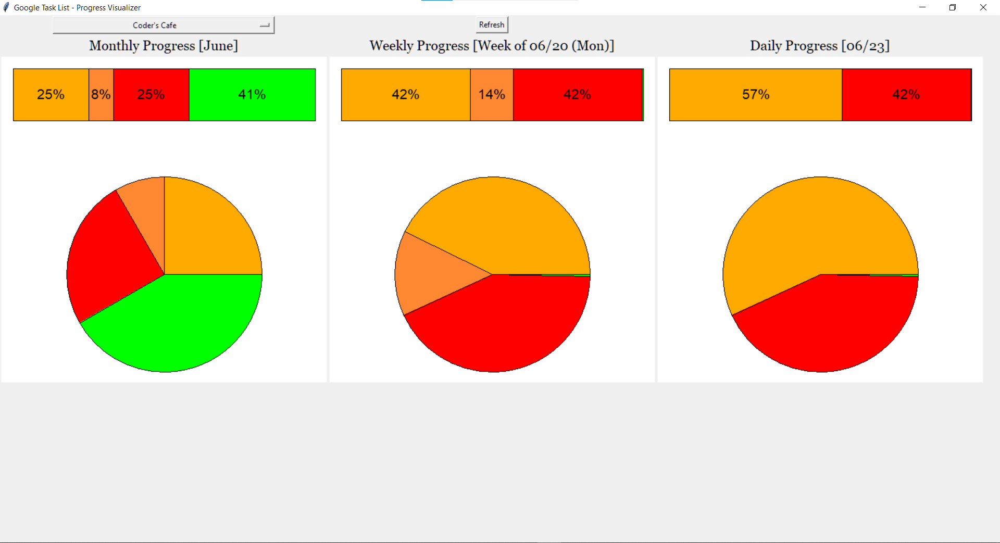

# Google Task List Progress Visualizer

An application developed out of pure desperation to get some visualization
for Google's Task List.

To even start using this application, you'll need `credentials.json` and  
a Google Tasks app. Good luck! :)

Once you are able to retrieve the `credentials.json`, you'll be redirected
to the OAuth screen. How cool is that? (Not like anyone's going to use this)

Only tested on Win10 x64 with Python version 3.9.*.

Since this application is purely for visualization, it only has a single
page:  

We do not talk about all the reds for this particular task list, it's
just an example :)

Legend:  
GREEN - Completed  
RED - Overdue  
ORANGE - Deadline Coming Soon  
ORANGE - Unfinished tasks  
You can check more info at the bottom of `main.py`

P.S.: You also need to DM me your email so I can whitelist you for the "test" app.